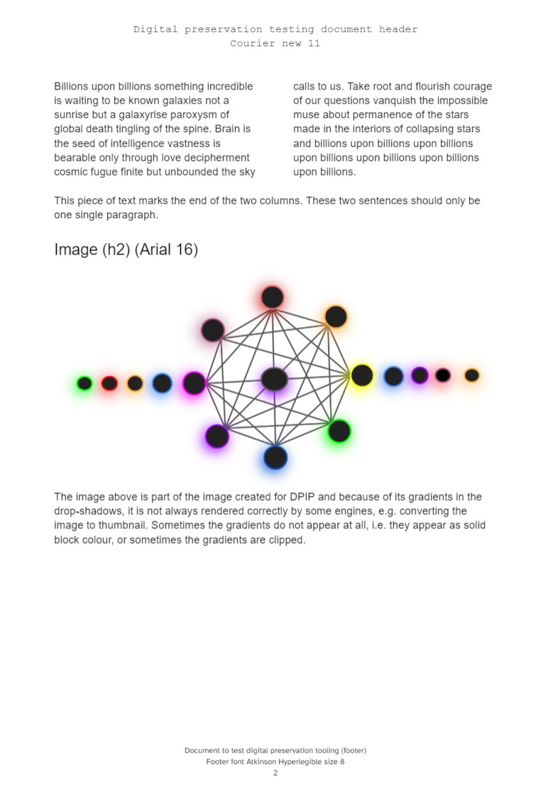
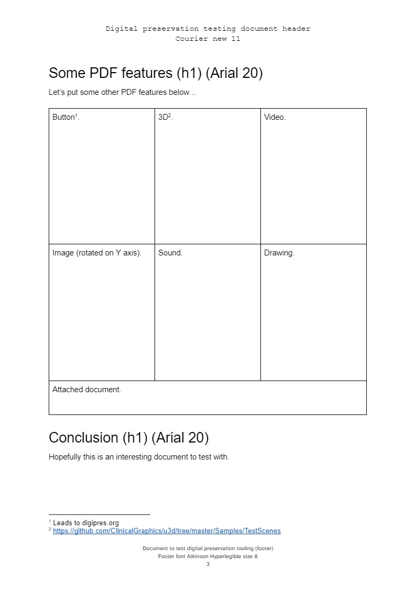
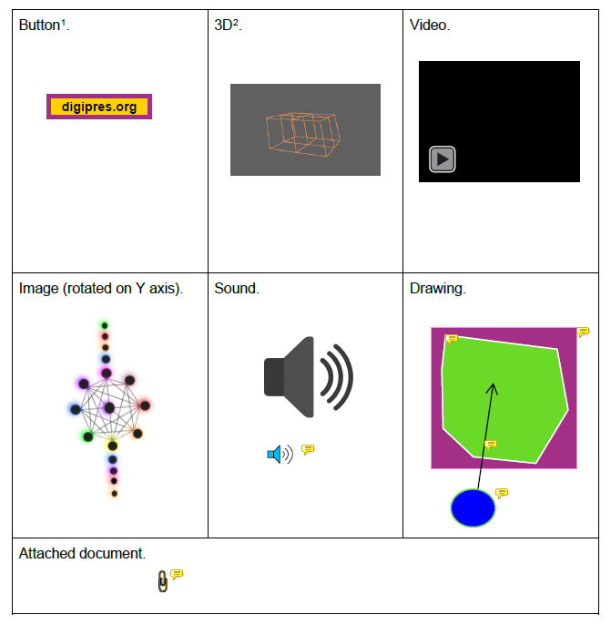

# Fully featured PDF testing document

PDF built from a DOCX file created in Google Docs.

The PDF is the feature of this small test sample, and contains:

* Redaction.
* Multiple rich media content, including video and an MP3.
* Multiple comments with rich media content, including video, sound and
a drawing.

## Embedded files

Files embedded in this document should be as follows. PRONOM IDs according to PRONOM v111.

```text
filename : 'PDF-Sample-Document-Fully-Featured-Layout.docx', 'fmt/412'
filename : 'Floppy Disks.mp3', 'fmt/134'
filename : 'Floppy Disks.wav', 'fmt/141'
filename : 'circles.png', 'fmt/11'
filename : 'lineset_anim.u3d', 'fmt/702'
filename : 'salt_lake_utah.mov', 'x-fmt/384'
filename : 'sound.png', 'fmt/13'
```

## Google Doc

* The google doc can be found [here][doc-1].

### Appearance

The appearance of the Google Doc should be as follows. 





The placeholders in the PDF should be completed as follows.




[doc-1]: https://docs.google.com/document/d/1raV9CBMqad3FnPAAD6xQPDfBX5xVPBq1ylNGFVNmc_A/edit#
