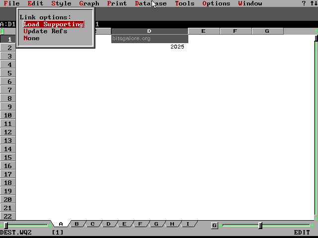
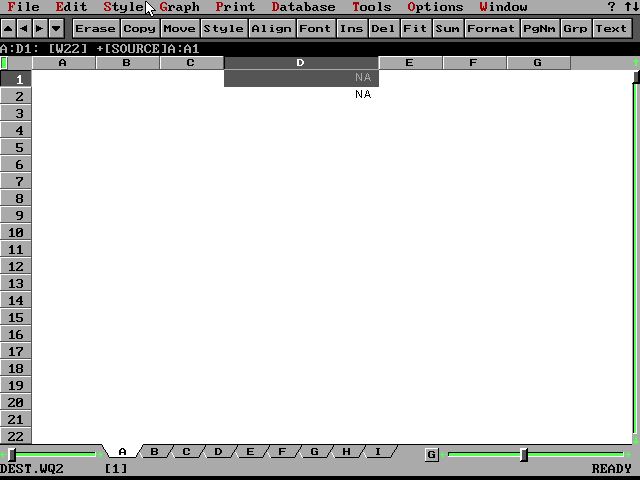
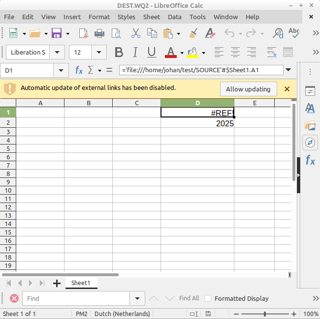
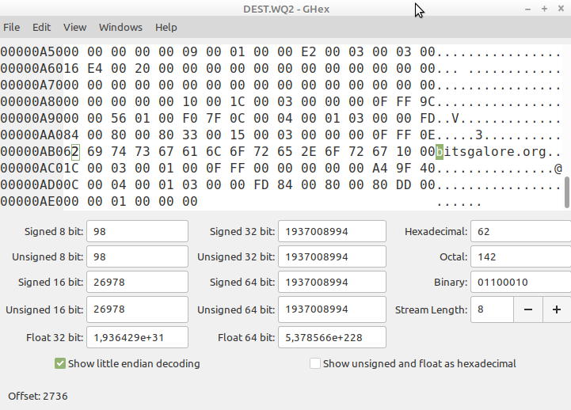

# External reference demo files

The purpose of these files is to provide a simple demo of how Quattro Pro stores static/cached formula values, which is implemented using external references.

[SOURCE.WQ2](./SOURCE.WQ2) has two cells that contain a text string and an integer number, respectively. [DEST.WQ2](./DEST.WQ2) references this file, and imports both values.

Copying [DEST.WQ2](./DEST.WQ2) to an empty directory will break this reference. Nevertheless, opening the file in Quattro Pro for DOS results in:



Here, both values are shown, which means they must be stored in the file. After selecting "None" in the Link options dialog, both cells show a NA value:



Opening the isolated file in LibreOffice Calc:



Note how Calc only shows the number, and a "#REF" value for the cell with the text string.

A peek inside the file with a Hex editor shows that the "bitsgalore.org" string is actually stored towards the end of the file, but it seems it isn't picked up by Calc:



I couldn't find any format spec for Quattro Pro for DOS, but I did come across [these old docs from the Corel developers site](https://web.archive.org/web/19961219170915/http://www.corel.com:80/partners_developers/ds/co32sdk/docs/qp7/Qpf4fmla.htm) that covers a later Windows version of the format. 

Section "The Formula Record" describes the following structure:

```
[record type = 16 (0x0010)]
[body length = variable]
<column> (0-255)
<page> not used
<row> (0-8191)
[attributes]
  bits 0-2: reserved
  bits 3-15: attribute ID.  This is an index to an attribute (cell
properties) in an attribute table of the saved notebook.
[value] formula value after previous evaluation.  (This is a standard,
8-byte floating-point number of type double)
[state] formula state
[length] length of formula (maximum of 1024 characters)
[reference begin] beginning position of cell references used in the
formula (these appear in order and in-line after the opcode and
operators themselves).
<formula> x ? formula byte codes
```

Here, "[value]" ("formula value after previous evaluation") appears to fit the description of a field that holds static values, but it *only* appears to cover floating point values.

The LibreOffice source repo [also refers to this documentation](https://github.com/LibreOffice/core/tree/master/sc/source/filter/qpro).

This makes me wonder to what extent these docs really describe how cached/static values are stored.  
