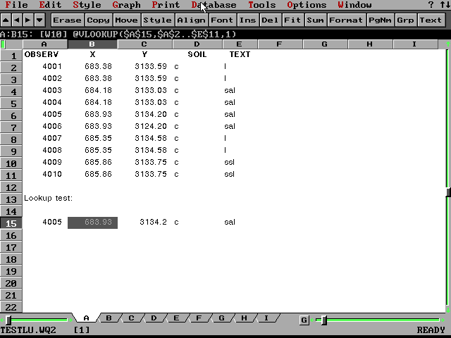
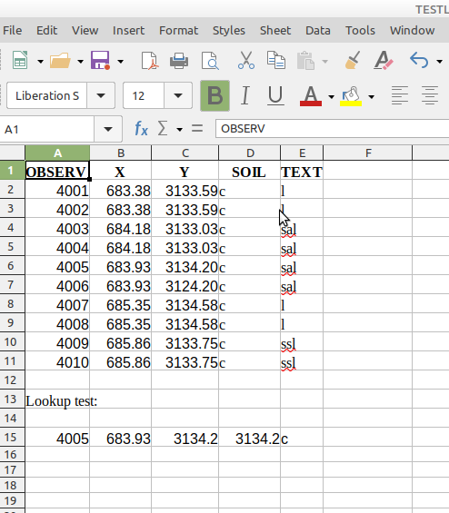
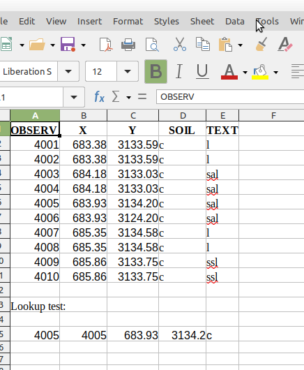

# VLOOKUP compatibility demo file

The file [TESTLU.WQ2](./TESTLU.WQ2) in this directory demonstrates a compatibility issue between the VLOOKUP functions of Quattro Pro for DOS and LibreOffice Calc.

It looks like this in Quattro Pro for DOS 5.0 (which is also the version I used for creating it), running in DOSBox-X:



The top 11 rows contain a 5-column block of data. This is used as a @VLOOKUP data table in row 15.

The data are queried with Quattro Pro's @VLOOKUP function, using the following formulas in cells B15, C15, D15 and E15, respectively:

```
@VLOOKUP($A$15,$A$2..$E$11,1)
@VLOOKUP($A$15,$A$2..$E$11,2)
@VLOOKUP($A$15,$A$2..$E$11,3)
@VLOOKUP($A$15,$A$2..$E$11,4)
```

This returns the expected values.

Opening the same file in LibreOffice Calc (I used version 6.4.7.2) initially results in this:



Note how the values in D15 and E15 are different from the original rendering in Quattro Pro (but oddly the values in B15 and C15 are correct!).

When I press Ctrl-Shift-F9 to re-calculate the spreadsheet, the values change to:



And now the pattern is clear: the values returned by Calc's VLOOKUP function are shifted by exactly one column to the right.

It seems that Quattro Pro and LibreOffice Calc treat the data block geometry in slightly different ways: in Quattro Pro, the number of the first column in the data block is 0, whereas it is 1 in LibreOffice Calc, which results in the shifted values.

Although I haven't explicitly tested this, I'm assuming that the @HLOOKUP function is also affected by this.

I don't know if this issue only applies to the Quattro Pro for DOS, or perhaps also to the later Quattro Pro for Windows formats.